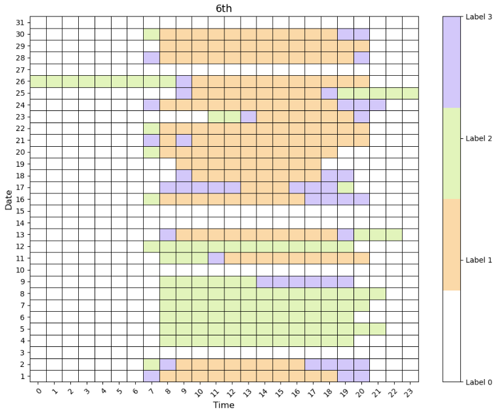
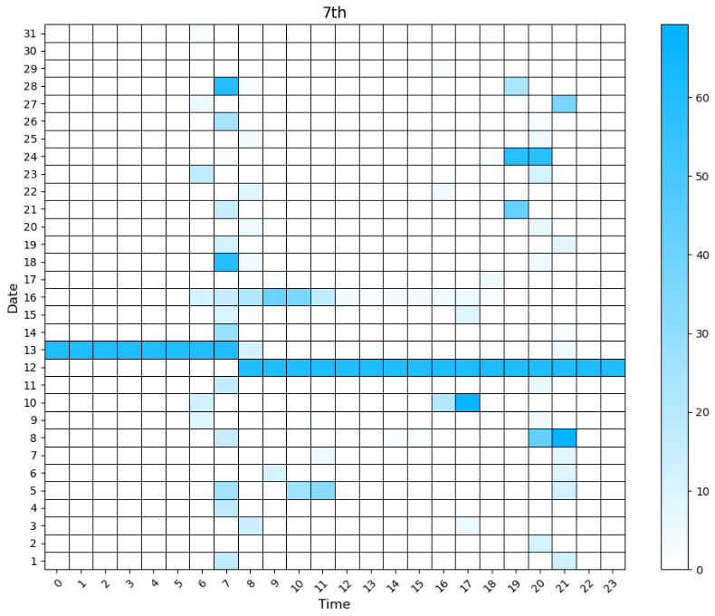

# EnergyAnalysis
BuildingEnergyAnalysis by heatmap

  
  

# Since this code cannot be disclosed for real data, it replaces the analysis results with code and images.
To explain the analysis, we visualize the residual between the actual set point and temperature for space in the building in the HVAC system, 
and when energy is consumed excessively or less.

This allows a person to check at what time and where an inefficient energy system is operating.
